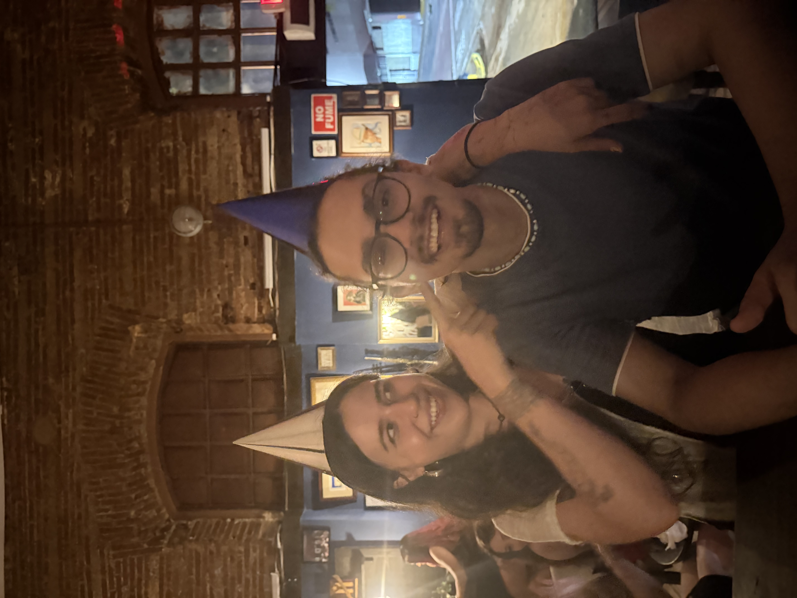

  

# About me

- My name is Jose C Zayas. I am in my 1st year of my masters program in Biology. I work with Dr. Clara Isaza Brando in her BioOptimatics Research Group. 

- My hobbies include reading, working out and art appreciation.

- I am working towards to be a  Bioinformatics specialist and contribute to a new age of sequencing technologies and genome visualization 

- For this R class my objectives are in the extraction and manipulation of data of Dengue and Lupus datasets in an effort to find a mechanistic link between viral inflammation signals and autoimmunity.

### R Tutorials Prompts: 
[HomeWork 1](assignments/assignments_1/Assigment-1.html)